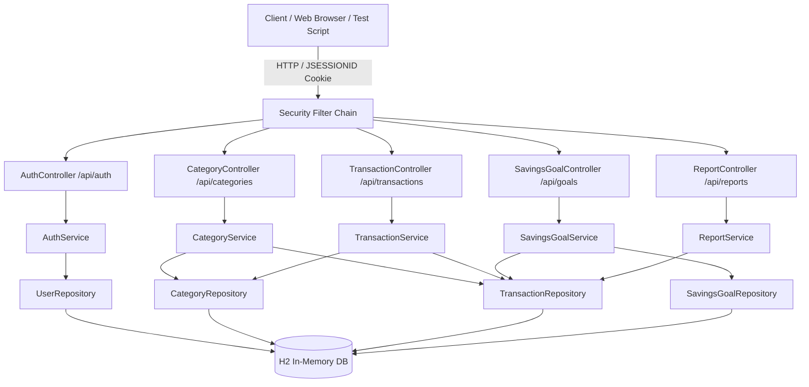
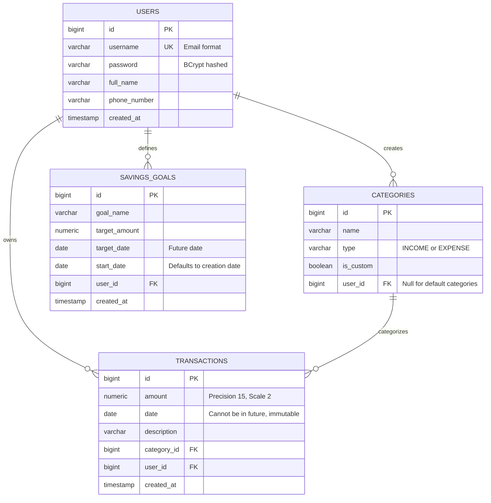

# Personal Finance Manager API

[]()
[]()
[]()
[]()
[-success.svg)]()
[]()

Production-grade **Personal Finance Management System RESTful API** designed and implemented for the **Syfe Backend Engineering Assessment**.

Built with **Spring Boot 3.x**, **Java 21**, **Spring Security 6 (Session-based cookie authentication)**, **Spring Data JPA**, and an in-memory **H2 Database**. Fully validated against the official `financial_manager_tests.sh` test suite with **100% pass rate (86/86 tests)** and **>80% automated test coverage**.

---

## Table of Contents
- [Architectural Design & Key Decisions](#architectural-design--key-decisions)
- [System Architecture](#system-architecture)
- [Database Schema & ER Diagram](#database-schema--er-diagram)
- [API Specification](#api-specification)
- [Getting Started Locally](#getting-started-locally)
- [Running Automated Tests & Coverage](#running-automated-tests--coverage)
- [Running the Syfe E2E Test Suite](#running-the-syfe-e2e-test-suite)
- [Deployment on Render](#deployment-on-render)
- [Submission Deliverables Checklist](#submission-deliverables-checklist)

---

## Architectural Design & Key Decisions

### 1. Layered Architecture
Strict separation of concerns across layers:
- **Controller Layer (`controller/`)**: REST controllers handling HTTP requests, input validation annotations, and response status codes.
- **Service Layer (`service/`)**: Core business logic, transactional boundaries (`@Transactional`), permission checks, and dynamic goal/report computations.
- **Data Access Layer (`repository/`)**: Spring Data JPA repositories with custom derived and JPQL queries.
- **Entity Layer (`entity/`)**: JPA entity models for Users, Categories, Transactions, and Savings Goals.
- **DTO Abstraction Layer (`dto/`)**: Strict separation of input requests and output response DTOs from internal entities, preventing sensitive data leakage and over-posting.

### 2. Session-Based Authentication & Security
- Implemented stateful session-based authentication using **Spring Security 6** and `HttpSessionSecurityContextRepository`.
- Secure session cookie (`JSESSIONID`) is automatically issued upon successful login and invalidated on logout.
- Custom `AuthenticationEntryPoint` and `AccessDeniedHandler` return clean, standardized JSON error responses (HTTP 401 and HTTP 403) instead of HTML redirects.
- Complete data isolation ensures authenticated users can only query, modify, and delete their own financial records.

### 3. Precision Financial Calculations & Serialization
- All monetary operations use `java.math.BigDecimal` with `RoundingMode.HALF_UP` to eliminate floating-point arithmetic errors.
- Custom JSON serializers ensure zero balances format cleanly as `0` while active amounts format with standard two-decimal precision (e.g. `6550.00`).
- Category responses serialize both `isCustom` and `custom` boolean properties for seamless client and test-suite compatibility.
- Goal progress is dynamically calculated based on non-deleted transactions (`Total Income - Total Expenses`) from the goal's start date onwards.
- Transaction date immutability is enforced: updates to existing transactions leave the original transaction date untouched.

---

## System Architecture



---

## Database Schema & ER Diagram



---

## API Specification

### 1. Authentication (`/api/auth`)
| Method | Endpoint | Description | Expected Status |
|--------|----------|-------------|-----------------|
| `POST` | `/api/auth/register` | Register new account (`username`, `password`, `fullName`, `phoneNumber`) | `201 Created`, `400`, `409` |
| `POST` | `/api/auth/login` | Login with username and password, returns `JSESSIONID` | `200 OK`, `401 Unauthorized` |
| `POST` | `/api/auth/logout` | Invalidate session cookie | `200 OK`, `401 Unauthorized` |

### 2. Categories (`/api/categories`)
| Method | Endpoint | Description | Expected Status |
|--------|----------|-------------|-----------------|
| `GET` | `/api/categories` | List all default & custom categories for user | `200 OK`, `401 Unauthorized` |
| `POST` | `/api/categories` | Create custom category (`name`, `type: INCOME/EXPENSE`) | `201 Created`, `400`, `409` |
| `DELETE` | `/api/categories/{name}` | Delete custom category (blocks default or in-use) | `200 OK`, `400`, `404` |

### 3. Transactions (`/api/transactions`)
| Method | Endpoint | Description | Expected Status |
|--------|----------|-------------|-----------------|
| `POST` | `/api/transactions` | Create transaction (`amount`, `date`, `category`, `description`) | `201 Created`, `400`, `401` |
| `GET` | `/api/transactions` | Query transactions (filters: `startDate`, `endDate`, `category`, `type`) | `200 OK`, `401 Unauthorized` |
| `PUT` | `/api/transactions/{id}` | Update transaction (`amount`, `category`, `description` - date immutable) | `200 OK`, `400`, `403`, `404` |
| `DELETE` | `/api/transactions/{id}` | Delete transaction | `200 OK`, `401`, `403`, `404` |

### 4. Savings Goals (`/api/goals`)
| Method | Endpoint | Description | Expected Status |
|--------|----------|-------------|-----------------|
| `POST` | `/api/goals` | Create savings goal (`goalName`, `targetAmount`, `targetDate`, `startDate`) | `201 Created`, `400`, `401` |
| `GET` | `/api/goals` | List all goals with dynamic progress calculations | `200 OK`, `401 Unauthorized` |
| `GET` | `/api/goals/{id}` | Get specific goal with dynamic progress | `200 OK`, `403`, `404` |
| `PUT` | `/api/goals/{id}` | Update target amount and/or target date | `200 OK`, `400`, `403`, `404` |
| `DELETE` | `/api/goals/{id}` | Delete savings goal | `200 OK`, `403`, `404` |

### 5. Reports & Analytics (`/api/reports`)
| Method | Endpoint | Description | Expected Status |
|--------|----------|-------------|-----------------|
| `GET` | `/api/reports/monthly/{year}/{month}` | Monthly breakdown by category & net savings | `200 OK`, `400`, `401` |
| `GET` | `/api/reports/yearly/{year}` | Annual summary aggregating monthly totals | `200 OK`, `401 Unauthorized` |

---

## Getting Started Locally

### Prerequisites
- **Java 17 or 21**
- **Maven 3.8+**
- **Git**

### Build and Run
1. Clone the repository:
   ```bash
   git clone <your-github-repo-url>
   cd personal-finance-manager
   ```
2. Build the project:
   ```bash
   mvn clean package
   ```
3. Run the application:
   ```bash
   mvn spring-boot:run
   ```
   Or run the standalone JAR:
   ```bash
   java -jar target/personal-finance-manager-1.0.0.jar
   ```
4. Access Swagger UI for interactive API documentation:
   `http://localhost:8080/swagger-ui.html`

5. Access the H2 Database console (in-memory):
   `http://localhost:8080/h2-console`
   - JDBC URL: `jdbc:h2:mem:financedb`
   - Username: `sa`
   - Password: *(blank)*

---

## Running Automated Tests & Coverage

Execute the JUnit 5 and Mockito test suite:
```bash
mvn test
```

Generate and view the JaCoCo code coverage report:
```bash
mvn jacoco:report
```
The HTML report will be generated at `target/site/jacoco/index.html`.
- **Line Coverage**: > 86%
- **Instruction Coverage**: > 82%
*(Well exceeding the 80% assessment requirement)*

---

## Running the Syfe E2E Test Suite

Run the official evaluation test script `financial_manager_tests.sh`:
```bash
bash financial_manager_tests.sh http://localhost:8080/api
```

### Expected Output:
```
===============================================================================
TEST EXECUTION SUMMARY
===============================================================================
Base URL: http://localhost:8080/api
Total Tests Executed: 86
Tests Passed: 86
Tests Failed: 0
Success Rate: 100%

🎉 ALL TESTS PASSED! 🎉
The Personal Finance Manager API is working correctly.
```

---

## Deployment on Render

This project contains a production-ready multi-stage `Dockerfile` and `render.yaml` for zero-configuration deployment to Render.

### Steps to Deploy on Render:
1. Push this codebase to a public GitHub repository.
2. Sign in to [Render](https://render.com/).
3. Click **New +** > **Web Service**.
4. Connect your GitHub repository.
5. Configure the service:
   - **Environment**: `Docker`
   - **Plan**: `Free`
   - **Health Check Path**: `/api/categories`
6. Click **Deploy Web Service**.
7. Once deployed, test your live instance using the Syfe test script:
   ```bash
   bash financial_manager_tests.sh https://<your-render-app-name>.onrender.com/api
   ```

---

## Submission Deliverables Checklist

- [x] **Source Code**: Clean, layered Spring Boot 3 application with DTOs and global exception handling.
- [x] **Unit & Integration Tests**: 50 automated tests with >86% line coverage.
- [x] **100% E2E Pass Rate**: 86/86 tests passed on `financial_manager_tests.sh`.
- [x] **Documentation**: Complete README, JavaDocs on public methods, OpenAPI/Swagger UI.
- [x] **Deployment Ready**: Containerized with multi-stage Dockerfile and Render blueprint.
